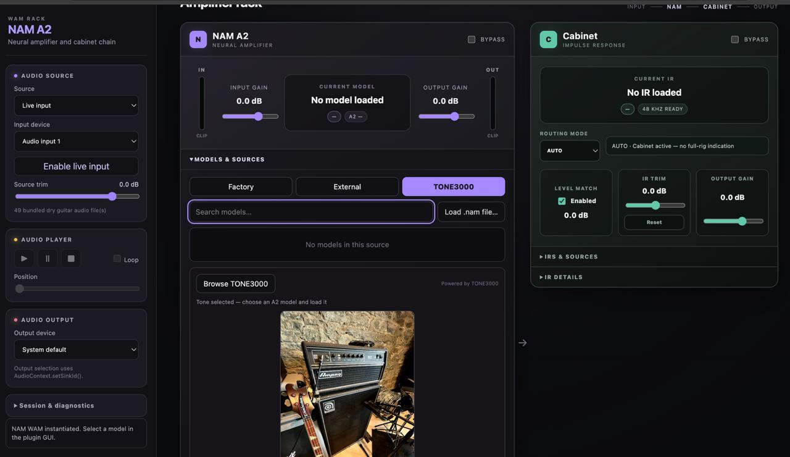

# NAM A2 WAM

## Serial effect chain

The main host shows the current NAM capture and Cabinet IR as photo cards. Click a `+` to insert a bundled effect at that position. Click any photo to open its editor; closing the editor preserves the running instance and its settings. Card controls and editor toolbars provide bypass. Cabinet AUTO still follows the selected NAM capture type.

NAM and Cabinet initialize their default assets without creating editors. Multiple instances keep independent WAM states. The **Session & diagnostics** save/restore controls now snapshot the whole chain in memory; factory/user preset management is a subsequent phase.

For a microphone-free real-browser test, open `examples/wam/fx-test/chain-validation.html` and click **Run headless and instance isolation tests**. The test renders audio into a muted measurement path and checks headless defaults, duplicate instances, state restoration and editor reuse. The same page is included under `dist/NAM_A2_WAM/fx-test/`.

Open-source WebAssembly/WAM audio effects prototype for guitar and bass. The project provides
a browser-based Web Audio host, a Neural Amp Modeler (NAM A2) plugin, a cabinet plugin based on
impulse responses (IRs), and TONE3000 Select Flow integration.

The repository contains the source code, the Factory assets required by the example host, and
the test suite. The `third_party/`, `dist/`, and build directories are not intended to be
committed.

## Features

- Web Audio/WAM host in [`examples/wam/`](examples/wam/).
- NAM A2 plugin in [`src/nam-wam/`](src/nam-wam/), with `.nam` model loading and safe replacement,
  a persistent Full/Lite rendering preference, rotary input/output gain, noise gate, three-band tone
  stack, six-band parametric EQ, bypass, and state restoration.
- Cabinet plugin in [`src/cabinet-wam/`](src/cabinet-wam/), with WAV IR loading, convolution,
  and level matching.
- Shared WASM/C++ backend in [`src/nam-wasm/`](src/nam-wasm/), built with
  NeuralAmpModelerCore.
- Shared assets and file browsing utilities in [`src/shared/`](src/shared/).
- TONE3000 model selection from the NAM panel through the Select Flow OAuth flow. Each user
  authenticates with their own TONE3000 account; the public `client_id` identifies the application
  and does not contain the author's session.
- A persistent Favorites library shared by Factory, External, and downloaded TONE3000 models.
  Favorites use IndexedDB; External favorites retain their model data and remain loadable after a
  browser restart.
- Automatic model-level compensation based on the loudness embedded in each NAM capture. It targets
  −18 dB, limits correction to ±12 dB, and leaves the manual Output gain control independent.

For `SlimmableContainer` captures, **Full** is the default network used for audio rendering. Open
**Preferences → A2 rendering mode** to select **Lite** when lower CPU usage is preferred. The current
model badge and details always report the network that is actually active.

Automatic model level is enabled by default and can be changed under **Preferences → Automatic
model level**. The correction currently applied to a capture is shown as a green `LEVEL ±x.x dB`
badge on the current-model card and in Model details. `LEVEL N/A` means that the file contains no
usable loudness metadata; such captures receive no automatic correction.

If a capture still sounds incorrectly matched, click **Calibrate level** on the current-model card.
This optional operation measures that model once with an internal low-level reference tone, applies
a static correction bounded to ±12 dB with peak protection, and resets the NAM state before normal
audio resumes. The reference tone is never routed to the output, and no adaptive gain runs while
playing. The badge changes to `MEASURED ±x.x dB`; click **Use metadata** to restore the default mode.
Measured values are remembered per capture and per Full/Lite variant in browser-local storage, so
reloading the same capture restores its calibration. Localhost and the deployed origin keep separate
calibration libraries.

The NAM faceplate follows the processing order used by the official TONE3000 desktop plugin:

```text
Input gain → Noise gate → optional PRE EQ → NAM → level correction → optional POST EQ
           → Bass/Middle/Treble → Output gain
```

Drag a rotary control vertically: upward increases its value and downward decreases it; hold Shift
for fine adjustment. Double-click restores its default value. Bass, Middle, and Treble are neutral
at `5`; the gate defaults to `−80 dB`. Click **EQ** to reveal the graphical six-band parametric
editor. Drag a point horizontally to change frequency and vertically to change gain; use the mouse
wheel for Q, or edit the selected band's numeric Frequency/Gain/Q fields. The plotted curve uses the
same RBJ coefficient equations as the audio processor. The EQ is disabled and POST NAM by default,
but can be moved before NAM. Its bands are low shelf at 100 Hz, four bells at 250 Hz, 650 Hz, 1.6 kHz
and 3.5 kHz, and high shelf at 8 kHz. Bypassed NAM and Cabinet modules use a red-tinted faceplate so
their inactive state remains immediately visible.

## Requirements

- Recent Node.js with npm.
- CMake 3.20 or newer and a C++20 compiler.
- Emscripten with `emcmake` available in the shell for the WASM build.
- The `third_party/NeuralAmpModelerCore` checkout. Third-party sources are intentionally ignored
  by Git.

## Run the host locally

Install dependencies, fetch third-party sources, build the WASM, then start the static server:

```sh
npm install
npm run setup
npm start
```

Then open <http://127.0.0.1:8765/examples/wam/index.html>.

The isolated WAM effect registry and compatibility lab is available at
<http://127.0.0.1:8765/examples/wam/fx-test/>. It discovers the bundled catalogue, categorizes
effects from descriptors and catalogue overrides, and validates plugin loading, GUI creation,
state round trips, bypass, and cleanup without changing the production NAM/Cabinet graph. See
[`docs/WAM_PLUGIN_REGISTRY.md`](docs/WAM_PLUGIN_REGISTRY.md).

The server automatically scans [`examples/wam/assets/audio/`](examples/wam/assets/audio/) to
discover `.wav`, `.mp3`, `.aac`, `.m4a`, `.ogg`, and `.flac` audio files. The host supports file
sources and live audio input, using the following signal chain:

```text
source → NAM A2 WAM → Cabinet WAM → audio output
```

The host requests a 48 kHz `AudioContext`, matching the sample rate used by the bundled and
TONE3000 NAM A2 models. If the browser or audio device cannot provide 48 kHz, the host displays a
diagnostic message and NAM model loading may be rejected by the core.

An automated validation page is available at
<http://127.0.0.1:8765/examples/wam/index.html?auto=1>.

## TONE3000 authentication

The TONE3000 tab starts with an authentication step following the Select Flow guidelines. Click
**Continue to TONE3000**, sign in or create an account, then return to the host to browse and
select a model.



The public client ID and redirect URI are loaded from [`examples/wam/config.js`](examples/wam/config.js),
not embedded in `index.html`. The configuration derives the redirect URI from the page currently
being opened, so the same source host works locally and on Mainline:

```text
http://127.0.0.1:8765/examples/wam/index.html
```

For deployment, add the exact HTTPS host URL to the allowed redirect URIs in TONE3000. The
TONE3000 secret must never be placed in `index.html`, a JavaScript file, or this repository. The
public client ID may be distributed in browser code; the session and tokens belong to each user
in their own browser.

Implementation details are in [`Tone3000Auth.js`](src/nam-wam/tone3000/Tone3000Auth.js),
[`Tone3000Client.js`](src/nam-wam/tone3000/Tone3000Client.js), and the NAM GUI
([`gui.js`](src/nam-wam/gui.js)).

Maintainers can open the host with `?maintainer=1`, select the TONE3000 tab, and export an explicitly
selected NAM A2 or IR tone as a repository-ready ZIP containing `tone.json`, its local cover image,
selected captures, hashes, creator attribution, and license metadata. See
[`docs/FACTORY_LIBRARY.md`](docs/FACTORY_LIBRARY.md) before importing or redistributing any tone.

## Build the project

### Native C++ build

```sh
cmake -S . -B build-native -DCMAKE_BUILD_TYPE=Release
cmake --build build-native -j 8
ctest --test-dir build-native --output-on-failure
```

The native executables are `build-native/nam_native` and `build-native/cabinet_native`.

### WASM build

```sh
emcmake cmake -S . -B build-wasm -DCMAKE_BUILD_TYPE=Release
cmake --build build-wasm -j 8
```

WASM artifacts are written to `build-wasm/dist/`. The host uses the static artifacts generated
in `dist/` by the following command:

```sh
npm run dist
```

This rebuilds the Factory manifests and produces a deployable static distribution.
`npm run build-static` is an alias for the same operation.

## Test

Run the complete JavaScript test suite:

```sh
npm test
```

The tests cover dynamic file discovery, the host, NAM-to-Cabinet routing, manifests, static
distribution, the AudioWorklet contract, and TONE3000 integration.

To compare native and WASM rendering for a reference model:

```sh
build-native/nam_native render \
  third_party/NeuralAmpModelerCore/example_models/A2.nam \
  /tmp/nam-native.f32
node tests/wasm_test.mjs \
  third_party/NeuralAmpModelerCore/example_models/A2.nam \
  /tmp/nam-wasm.f32
python3 tests/compare.py /tmp/nam-native.f32 /tmp/nam-wasm.f32
```

Regenerate asset analyses with:

```sh
node tools/analyze_models.mjs
node tools/analyze_ir_levels.mjs
```

## Modify the project

### Modify the host

- UI and styles: [`examples/wam/index.html`](examples/wam/index.html) and
  [`examples/wam/host.css`](examples/wam/host.css).
- Audio graph initialization and controls: [`examples/wam/main.js`](examples/wam/main.js).
- Audio source management: [`examples/wam/SourceManager.js`](examples/wam/SourceManager.js).
- NAM/Cabinet routing: [`examples/wam/CabinetRouting.js`](examples/wam/CabinetRouting.js).
- Local server and audio discovery: [`examples/wam/server.mjs`](examples/wam/server.mjs).

### Modify the plugins

- NAM: [`src/nam-wam/index.js`](src/nam-wam/index.js), [`NamNode.js`](src/nam-wam/NamNode.js),
  [`NamProcessor.js`](src/nam-wam/NamProcessor.js), and [`gui.js`](src/nam-wam/gui.js).
- Cabinet: [`src/cabinet-wam/index.js`](src/cabinet-wam/index.js),
  [`CabinetNode.js`](src/cabinet-wam/CabinetNode.js),
  [`CabinetProcessor.js`](src/cabinet-wam/CabinetProcessor.js), and [`gui.js`](src/cabinet-wam/gui.js).
- C++/WASM interface: [`src/nam-wasm/`](src/nam-wasm/).

After changing code or assets, run `npm test`, then `npm run dist` if the deployed distribution
must be updated.

## Repository layout

```text
src/nam-wam/       NAM A2 plugin and TONE3000 integration
src/cabinet-wam/   Cabinet plugin and Factory IRs
src/nam-wasm/      C++ wrappers compiled to WASM
src/shared/        Shared utilities
examples/wam/      Web Audio/WAM host and demo audio files
tests/             Node.js tests, static contracts, and distribution tests
tools/             Builds, manifest generation, and asset analysis
docs/              Technical notes and integration phase reports
third_party/       External dependencies, not committed
dist/              Generated distribution, not committed
```

## Additional documentation

- [`docs/phase3d-model-analysis.md`](docs/phase3d-model-analysis.md) — NAM model and IR asset
  analysis.
- [`docs/phase4a-cabinet-wam.md`](docs/phase4a-cabinet-wam.md) — Cabinet WAM architecture.
- [`docs/phase4a1-usability.md`](docs/phase4a1-usability.md) — level matching and AUTO routing.
- [`docs/FACTORY_LIBRARY.md`](docs/FACTORY_LIBRARY.md) — rich NAM/IR Factory bundle format
  and maintainer-only TONE3000 import workflow.
- [`HANDOFF.md`](HANDOFF.md) — detailed project status and next steps.

## Git and files to commit

The `.gitignore` excludes builds, `dist/`, third-party dependencies, and out-of-scope prototypes.
To stage the code, host, plugins, and documentation:

```sh
git add .gitignore package.json CMakeLists.txt \
  src/nam-wam src/cabinet-wam src/nam-wasm src/shared \
  examples/wam tools tests HANDOFF.md docs README.md
```

Review the staged content before creating a commit:

```sh
git status --short
git diff --cached --stat
git diff --cached --name-only
```
